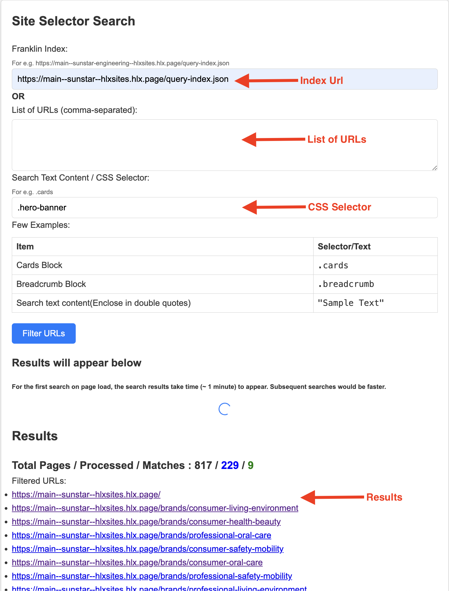

# Markup Finder Tool

## Introduction
For finding elements in web pages using CSS selectors.

### How to use
1. Install [Docker](https://docs.docker.com/get-docker/)
2. Run `docker run -p 3001:3001 -d --name web-tools satyadeepm/web-tools:latest`
3. OR if you don't want to use Docker, just synch this repository and execute the following:
    ```
    $ npm i
    $ npx playwright install
    $ npx playwright install-deps
    $ node app.js
    ```
5. Open `http://localhost:3001/finder/finder.html` in your browser.
6. Provide inputs and click on `Filter URLS` button

