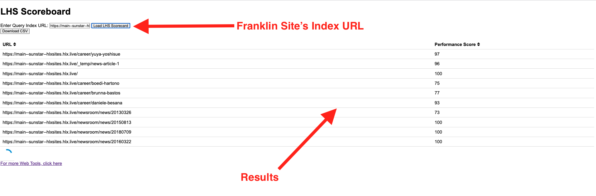
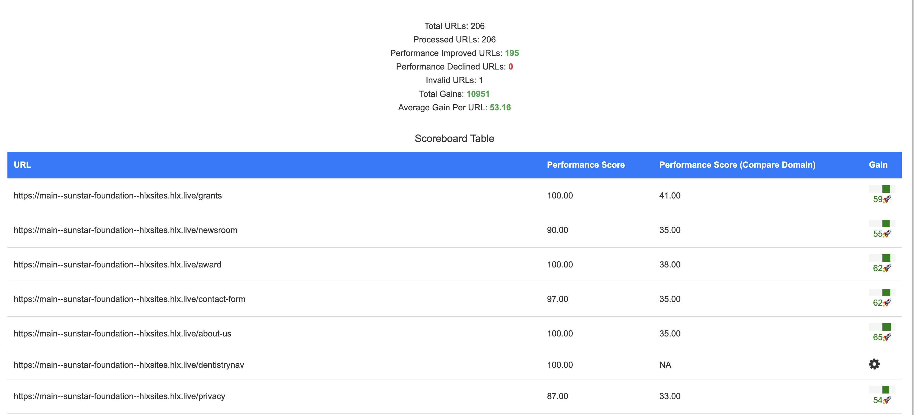

# Tool to find LHS for all indexed pages in a site

## Introduction
For computing the LHS score for specified list of URLs and do a comparison with the LCP score for the same URLs from another domain.

### How to use
1. Install [Docker](https://docs.docker.com/get-docker/)
2. Run `docker run -d -p 3001:3001 -e psikey=<optional-psi-key> satyadeepm/web-tools:latest`
3. OR if you don't want to use Docker, just synch this repository and execute the following:
    ```
    $ npm i
    $ npx playwright install
    $ npx playwright install-deps
    $ export port=<optional-port>; export psikey=<optional-psi-key>;node src/app.js
    ```
5. Open `http://localhost:3001/lhs/lhs.html` in your browser.
6. Provide the list of URLs for which you'd want to run the report
```
https://main--sunstar-foundation--hlxsites.hlx.live/grants
https://main--sunstar-foundation--hlxsites.hlx.live/newsroom
https://main--sunstar-foundation--hlxsites.hlx.live/award
```
7. Optionally provide a compare domain to compare the LHS scores with this domain. For e.g. `www.sunstar-foundation.org`

8. The report will be generated and displayed in the browser.
9. You can also download the report as a CSV file or print it as a PDF.


