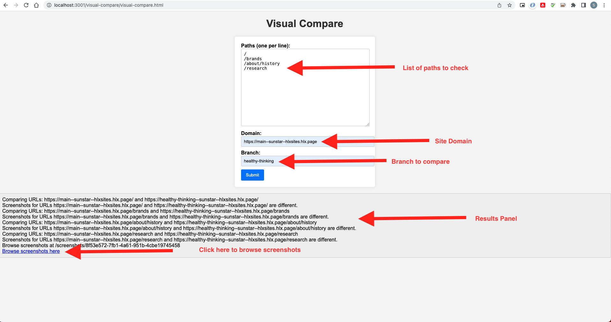
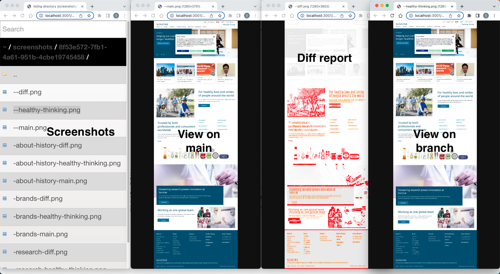

# Visual Compare Tool

## Introduction
For visually comparing web pages to find differences between them.

### How to use
1. Install [Docker](https://docs.docker.com/get-docker/)
2. Run `docker run -p 3001:3001 -d --name web-tools satyadeepm/web-tools:latest`
3. Open `http://localhost:3001/visual-compare/visual-compare.html` in your browser.
4. Provide inputs

5. Review the screenshots
